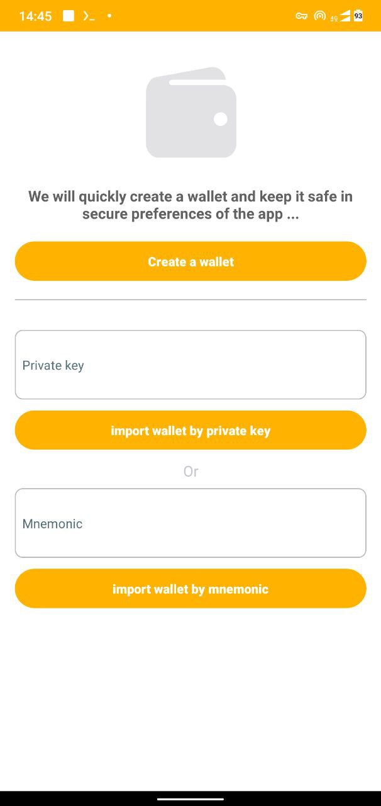
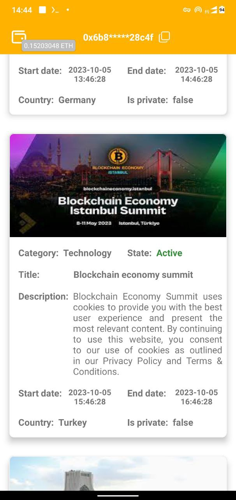
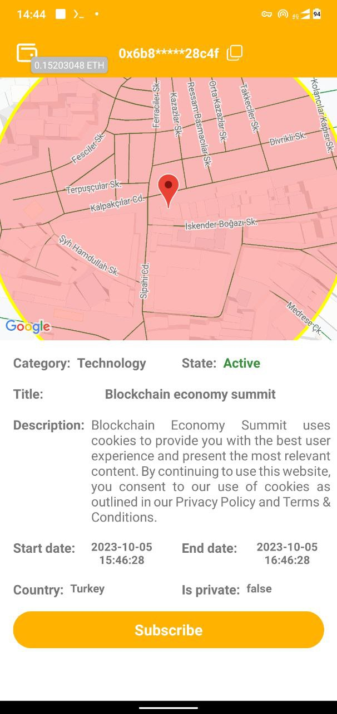
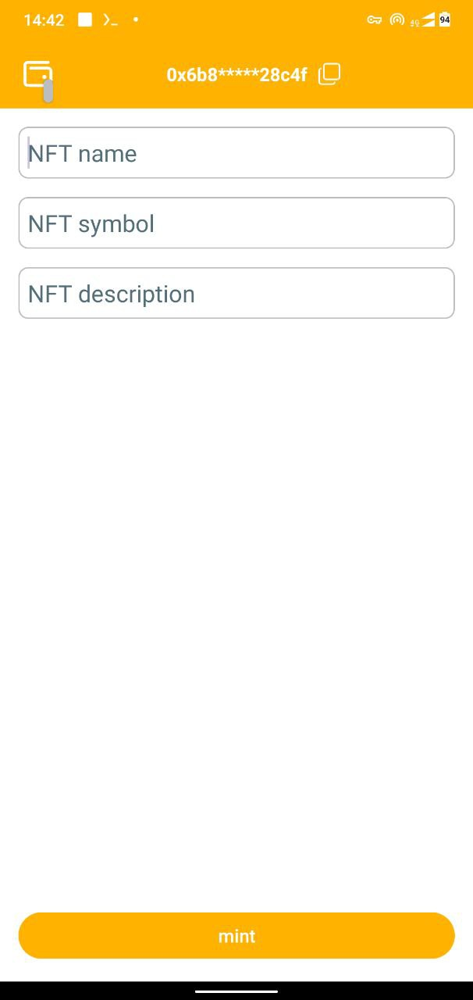
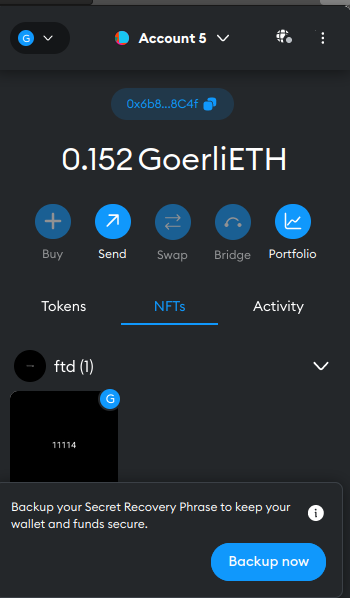

Evenft

Project Overview

Usually, NFTs are considered assets related to works of art, such as images, music, etc., and this issue slightly limits our view of its more precise meaning.

The main idea of this platform is to mint NFTs based on attendance at various events. Suppose people participate in an important event. At first, people prove their presence in the event, and after proving their presence, they can subscribe to it only at the moment of the event.
At the end of the event, the blockchain network chooses one person as the winner from among the people who registered in the event. And the winning person can mine and own or sell the NFT related to attending that event.

Documnet:
https://docs.google.com/document/d/1MEeLCs7gATc7SC8-mJbQyh1IFVY4fvsJvZO6UazTfxw/edit?usp=sharing

contracts:
https://github.com/vahidmohammadisan/evenft_contracts

<!-- Top Row -->

  
  
    
  
  

